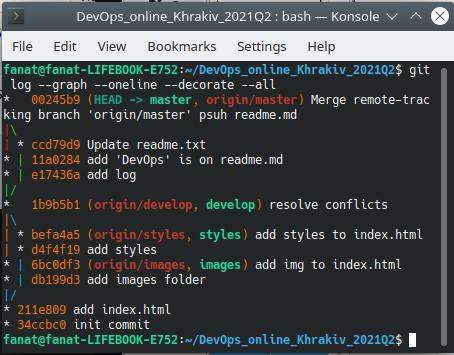

1. I was install Git on my workstation and change my global configs.
2. I was created account on GitHub and new private repo.
3. I was cloned repo to my workstation.
4. I was created repository structure and 3 branch (develop, images, styles).
5. I was commited changes on my branhes and merged 'styles','images' on 'develop' without unresolved conflict.
6. Merged 'develop' into master branch.
7. I was pusshed my local repo on GitHub.
8. Added my trainers as collaborators.
9. Maked file readme.md ad described results of my work with Git.
 

-----------
### DevOps it is a methodology, a set of concepts, approaches and tools that improve the ability of companies to create applications and services at high speed and with less cost. An DevOps Engineer is responsible for deploying and maintaining the code infrastructure, monitoring processes, and quickly troubleshooting.
