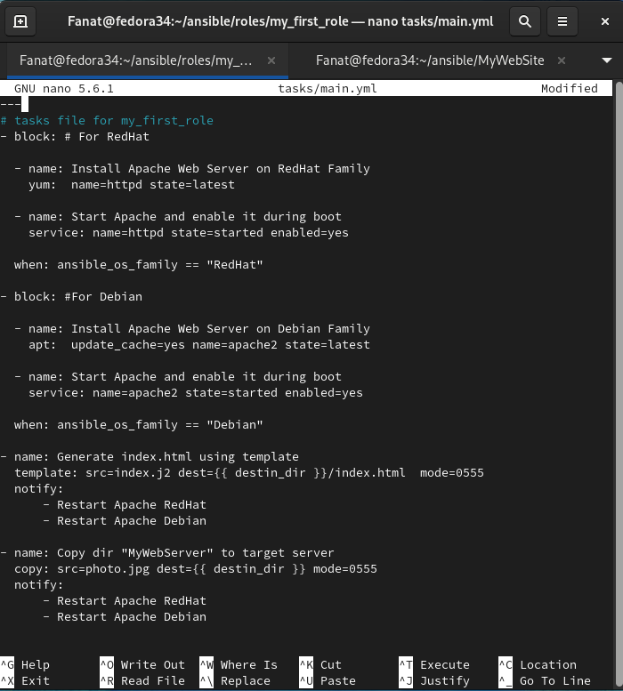

### Configuration Management. Ansible.

I installed ansible on my laptop from Fedor 34. 
 

 
The Host file contains the static IPs of my EC2 inputs instance:
 

This is how the config file for ansible looks like:
 

 
Variables for different servers are moved to group_vars:

For all servers:  
 

For AMI Linux (Server for Jenkins):  
 

For AMI Ubuntu 20.04 (Server for project):  
 

 
Ad-Hoc commands for my servers:
 

 

 

 

-------------------------

### Playbooks
Next, I launched my first playbook (ping servers):
 

<a href="files/playbook1.yml">files/playbook1</a>

 
My second playbook (Apache installation on AMI Linux):
 

<a href="files/playbook2.yml">files/playbook2</a>

 
Then I tried a playbook with a loop:
 

 
<a href="files/playbook_loop.yml">files/playbook_loop</a>

 
In playbook number 3, the following steps were combined and used:

 1. Check Linux distro;
 2. Install Apache Web Server on Ubuntu and AMI Linux;
 1. Start Apache and enable it during boot;
 2. Generate index.html using Jinja template;
 3. Copy dir to target server;
 4. Restart web-server (Apach) use handlers;

<a href="files/playbook3.yml">files/playbook3</a>

<a href="files/index.j2">files/index.j2</a>

Displaying the imported page:

Next, I experimented with encryption using Vault by HashiCorp.

-------------------------

### Roles

I created my first role

 
And turned my playbook3 into a role

 
Created a playbook to play the role

<a href="files/playbook_for_roles.yml">files/playbook_for_roles</a>

 
I have uninstalled Apache on Linux AMI

and launched a playbook to perform the role

