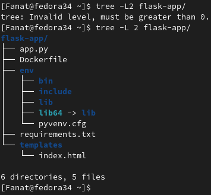
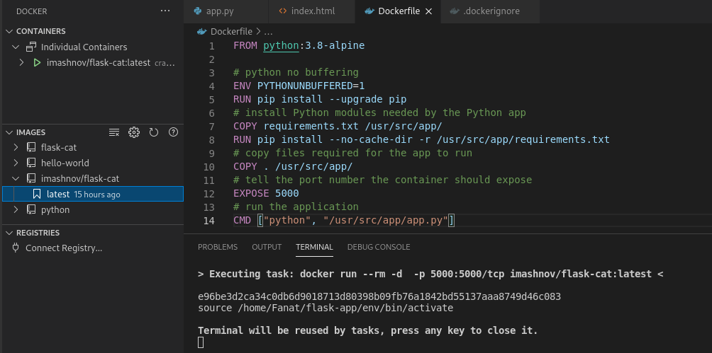
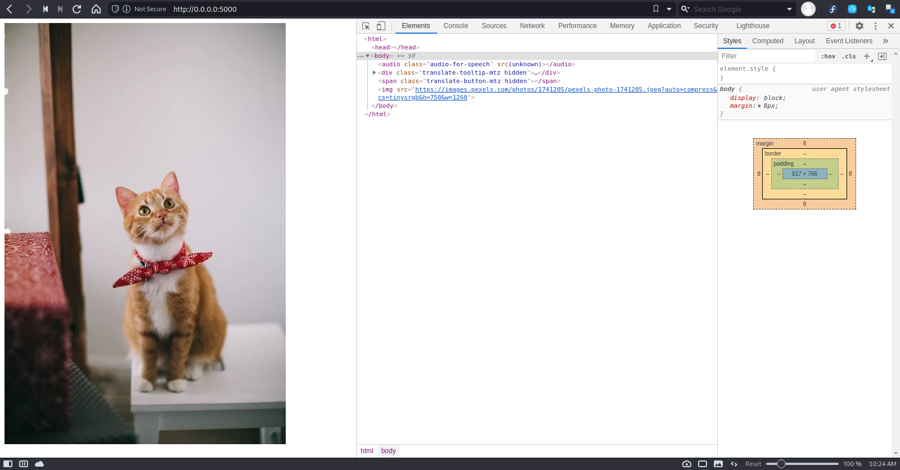
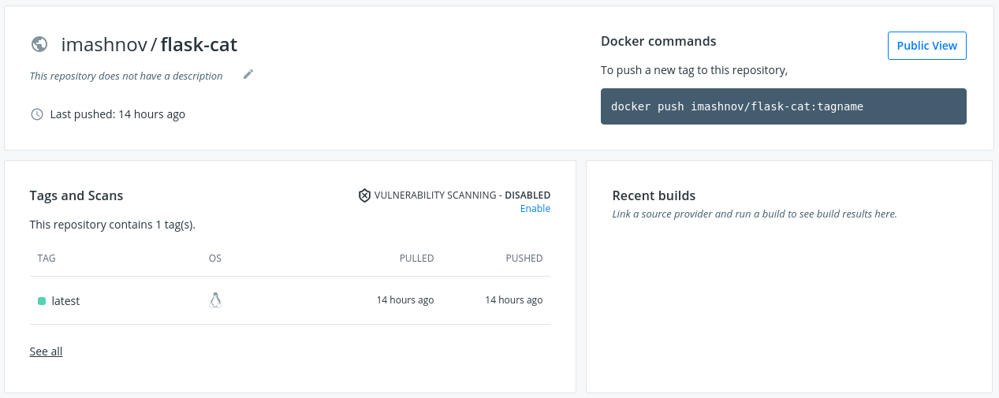

### Containerization. Docker
#### Webapps with Docker

I created a Python Flask app that displays random cat pix and push my docker image to docker hub repository.
<br>
<p></p>
<br>
<p></p>
<br>
<p></p>
<br>
<p></p>
<br>
All files for project: /files
My image: 

```
docker pull imashnov/flask-cat
```