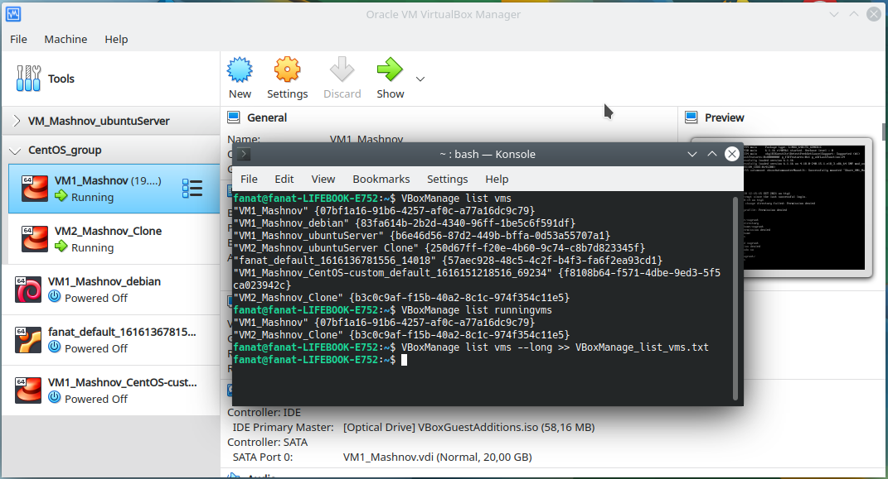
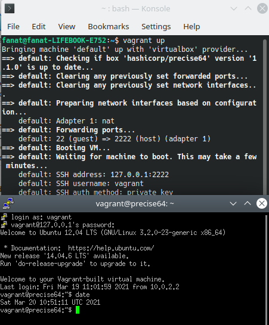
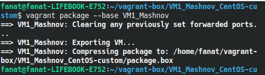
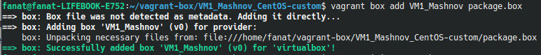
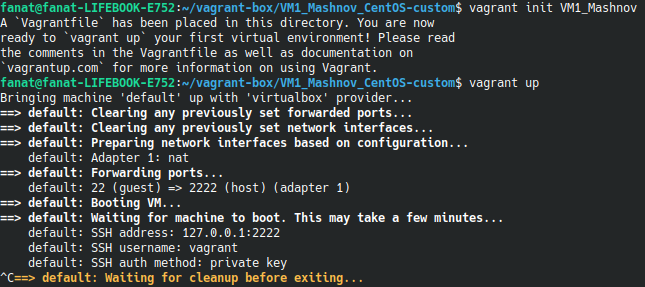
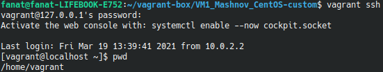

### Part 1: Hypervisors
1. The most popular hypervisors is Hyper-V, VMware. Each of the solutions allows you to run multiple virtual machines with any operating system on one physical server. All guest operating systems work in their own isolated environment.
2. The most popular hypervisors, Hyper-V and VMware, differ in architecture (these are the first-level virtualization hypervisors, meaning that the hypervisors themselves are installed on hardware, and virtual machines are already on top of them): 
   - Monolithic architecture - **(VMware ESXI)** hypervisor runs on physical hardware and makes decisions on its management. But the guest wasps working on it are one level higher, and work through it. Due to what, this type has the maximum performance in comparison with the second type.
   - Microkernel hypervisor - **(Microsoft Hyper-V)** device drivers are installed inside the parent OS (host) In fact, the host operating system (Parent Partition) is launched as a virtual machine, in the same environment as all virtual machines, all other children are now. The only difference between them is that the parent virtual machine is the only one that has direct access to the server hardware. And the hypervisor deals with the allocation of all kinds of resources, various schedulers and optimization of capacities.

---------------------------
### Part 2: Work with VirtualBox
1. I was created VM1 and instaled CentOS 8 and cloned to create VM2. Then I united them into a group and played with the configurations of the virtual machines. Made snapshot for configured VM.
2. I was configured USB connecrtions, shared folder and different network models ([information about](VBoxManage_list_vms.txt)).
    

----------------------------
### Part 3: Work with Vagrant

1. I was initialized the enviroment with the default Vagrant box 'hashicorp/precise64', upped him and connected with ssh (used the program PuTTY).
    

2. Was create own Vagrant box, based on CentOS8 in VirtualBox.
    

    

    

    

