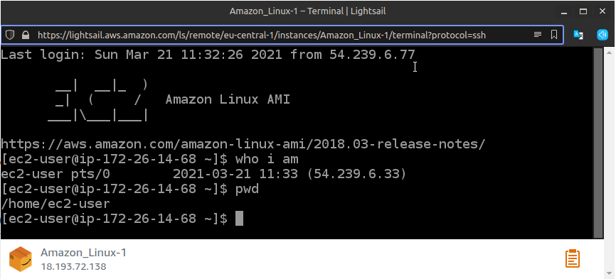
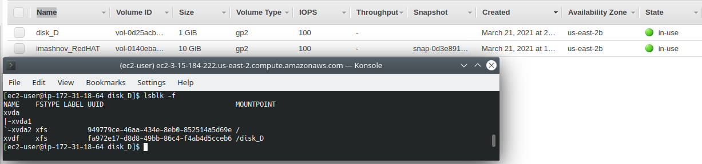
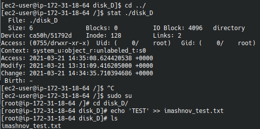
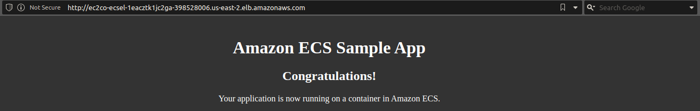

### Virtualization and Cloud Basic
1. I registered on AWS.
2. Viewed AWS toturials on YouTube.
3. Launched Linux virual Machine with Amazon Lightsail.
    

4. Launched Linux virual Machine with RedHat operating system.
    

5. Created a snapshot and made backup from it.
    

6. Created and attached a Disk_D (EBS) to mine istance.
    

   

   

7. Launched the third instance from backup and attached Disk_D to it.
    

   

   

8. Launched and configured a WordPress instance with Amazon Lightsail.
     

9.  Created own repository (stored and retrieved file) with Amazon S3.
10. Made batch upload files to the cloud with Amazon S3 used the AWS CLI. Created AWS IAM and configured CLI AWS.
11. Explored the possibiliities of creating own domain and domaine name for mine site with AWS Route 53.
12. Deployed Docker Containers on Amazon Elastic Container Service (Amazon ECS) and ran the online demo application.
     

    

13. <B>Created a static website on Amazon S3, publicly available, with the completed AWS labs and services which i worked within the educational program and earlier.</b>
     

     
 <h2>The website link: <h3><i>http://imashnovwordpress.s3-website.us-east-2.amazonaws.com</h2></i>