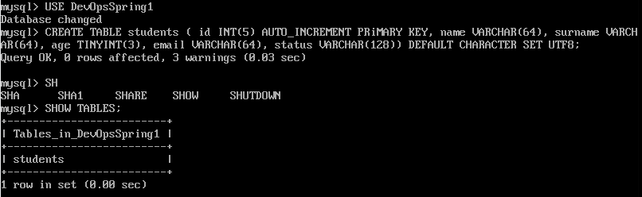

### Database Administration

---------

### Part 1: MySQL on VM
1. I installed MySQL server on my OS and my VM running on CentOS.
    

    

     
2. Сreated a schema of 3 tables in a new database.
   

    

    

    

3. Constructed and executed SELECT operator with WHERE, GROUP BY and ORDER BY.
   

   

4. Executed different DDL, DML and DCL SQL queries.
5. Connected to the databases as a new user with different privileges.
   

6. Made selection from main DB mysql.
   
---------

### Part 2: RDS AWS
1. Made backup my database with VM and restored its.
   

   

2. Transfered my local database to RDS AWS.
    

    <
    

3. Connected to my RDS and executed SELECT queries.
   

4. Made dump of my RDS database.
   

---------

### Part 3: Amazon DynamoDB
1. I created an DeynamoDB table.
2. Entered data into DeynamoDB table.
      
   

3. Made selection from table using Query and Scan.
   
   

4. Added new experience to my lab collection (http://imashnovwordpress.s3-website.us-east-2.amazonaws.com).