### Networking Fundamentals

---------

### Part 1

1. I put together a network (image below).
2. Each PC is assigned a unique IP.
3. Checked network operation by ICMP packets among PCs.
   
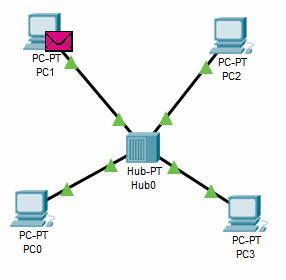

4. Traced the flow of packets over the network in simulation mode.
   
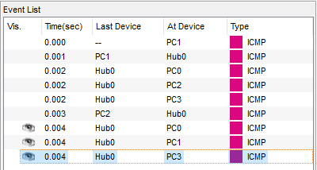

5. Traced information about packages according to the OSI model.
   
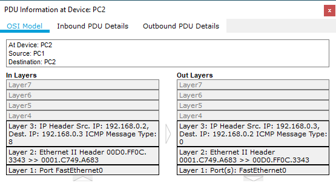

---------

### Part 2

1. Created the following network (image below) and tested.
   
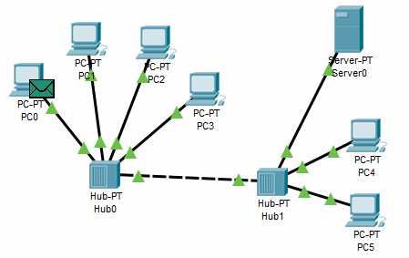

---------

### Part 3

1. Created the following network (image below) and tested.
   
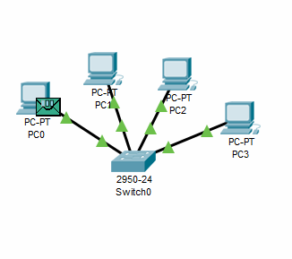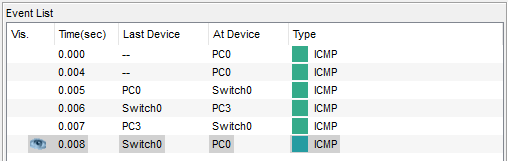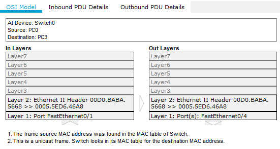

2. <b>Differences in network performance in parts 1, 2 and 3:</b> The hub sends a network packet will send to everyone who is connected to it, addressing in the switch is based on the mac device address table. Each network device or computer has a unique mac address and the switch maintains a table of mac addresses, the switch knows on which port the mac address (network device) is located, and when it sees a packet for it, it sends it not as a hub to everyone, but only to one addressee. As a result, the network load is less.

---------

### Part 4

1. I expanded the network from Part 3 to a 2-switch network (image below) and tested it.
   
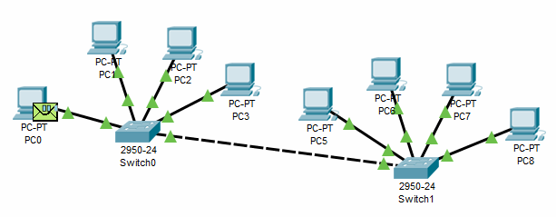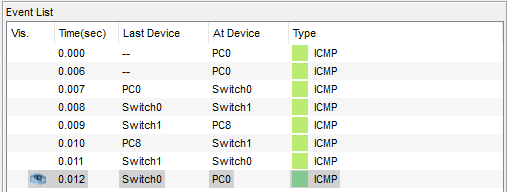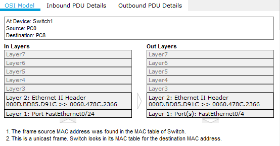

---------

### Part 5

1. I divided the existing network from Part 4 into two identical subnets using a router and fiber (image below).
2. I assigned the IP of the corresponding networks to the router ports
3. Specified the required gateway on each PC.
    
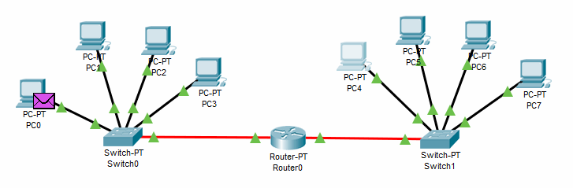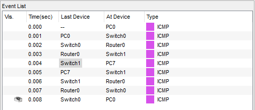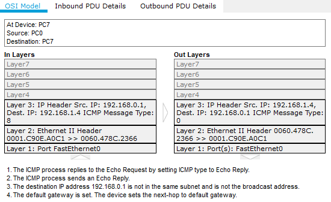

4. <b>Differences in network performance in parts 3, 4 and 5:</b> The switch stores a patch plate in memory, which displays which port corresponds to the MAC (and works at the second level of the OSI model). If the device is not familiar with the MAC from the recipient, then the frames will be sent to all ports except the one from which they were sent. The router works with the recipient's address (at the third level of the OSI model), which is indicated in the header of the data block. The information stored in the routing table specifies the path along which it will transmit them. If it is not indicated, then the device will discard the packet.
The router can determine the path using the sender's IP, as well as other information that is displayed in the headers of the info packets. All these features of the router make it possible to reduce the load on the network. Switches are needed so that PCs can exchange data within the same network, using a router, those PCs that are part of different networks can also exchange data.
