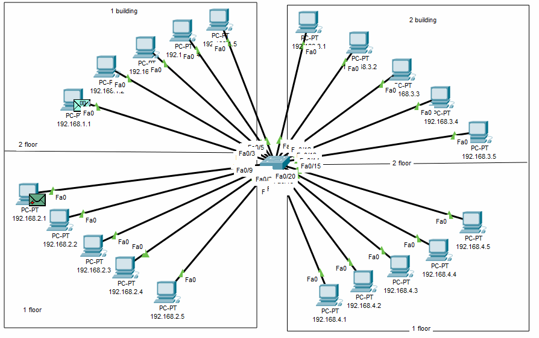
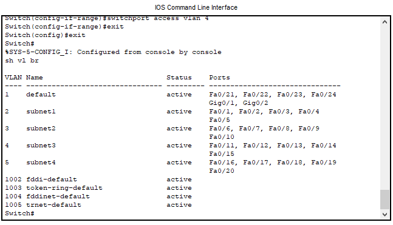
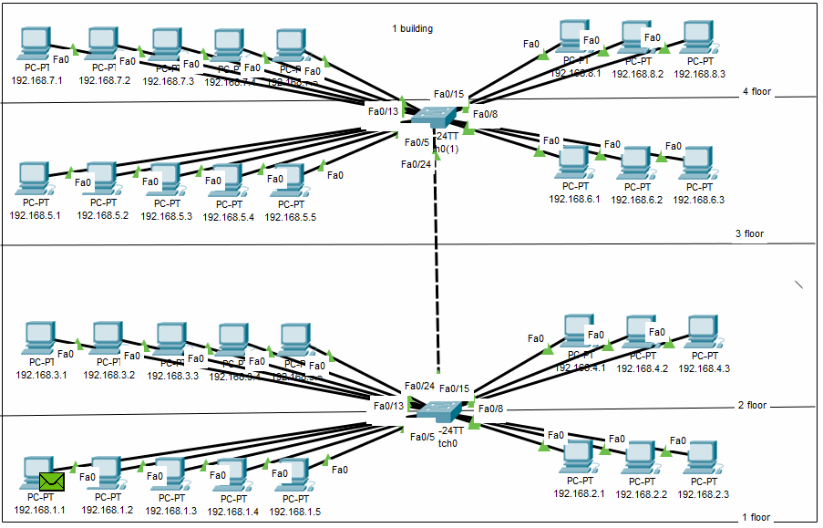
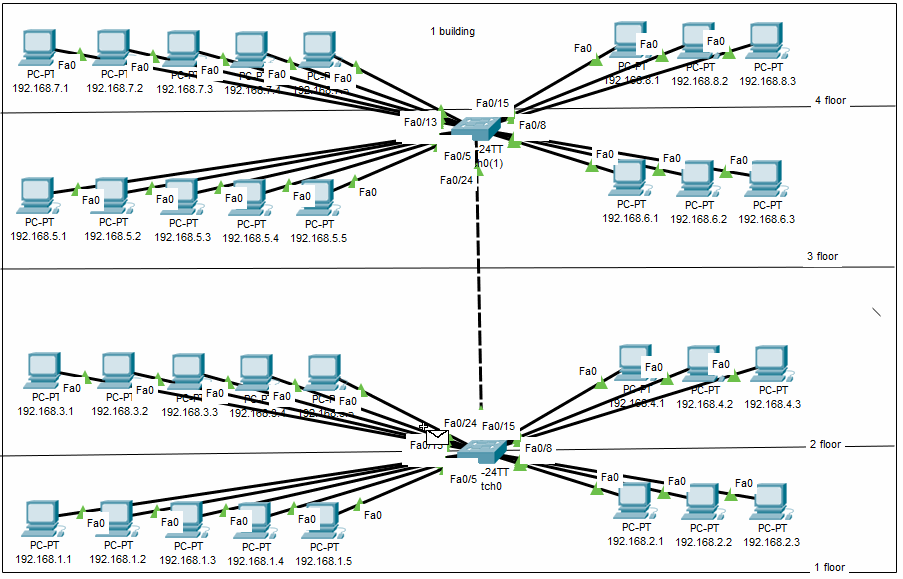
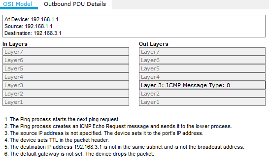
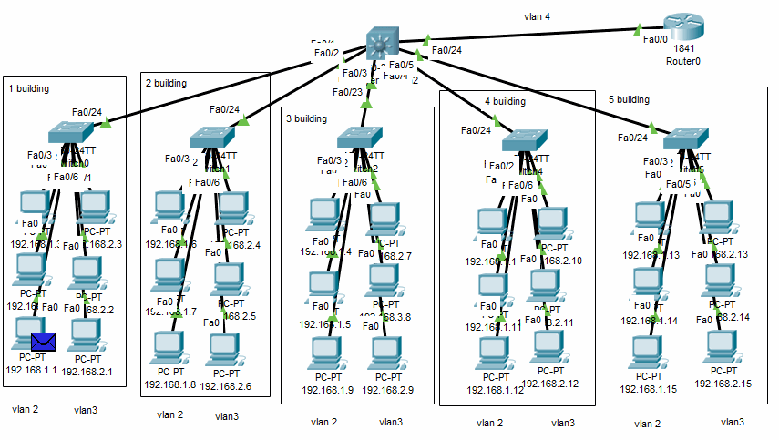
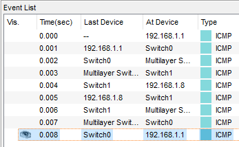
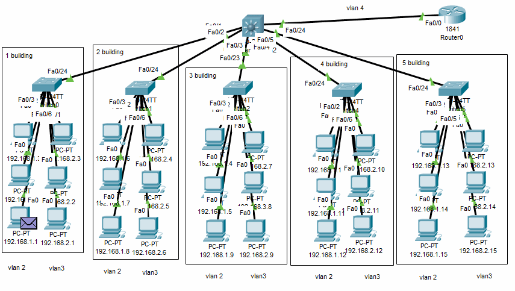

### Networking Fundamentals

---------

### Part 1

1. I modeled a corporate network of an organization, consisting of 2 houses, two floors each, the floor subsystem consists of one vlan with 5 PCs.
    

    

2. PCs on the same floor can exchange packages as they are in the same vlan. PCs on different floors do not see each other in the switch routing table.

---------

### Part 2

1. I have modeled a corporate network of an organization that consists of one house with 4 floors. The floor subsystem consists of 2 vlans, 3 and 5 PCs each. Made a logical scrolling of the network into 8 subnets.
    

2. PCs in one vlan can exchange data and do not see PCs from other vlans.
    

    

---------

### Part 3

1. I modeled a local area network consisting of 5 buildings on the 1st floor. One building - one vlan. The network is built on the basis of an L3 switch for the possibility of output to a router.
    

2. Data transmission in one vlan through L3 switch: PC1 (192.168.1.1) transmits a packet to the switch in building 1, PC8 (192.168.1.8) is not in the switch1 routing table. Packets are sent to all connected devices other than PC1 (which sent the packet). L3 switch receives a packet, using routing IP sends the packet to switch2, which in turn knows the MAC of PC8 (192.168.1.8).
    

3. With this scheme, personal computers can have access to the Internet through a router and communicate within the same vlan.
   

