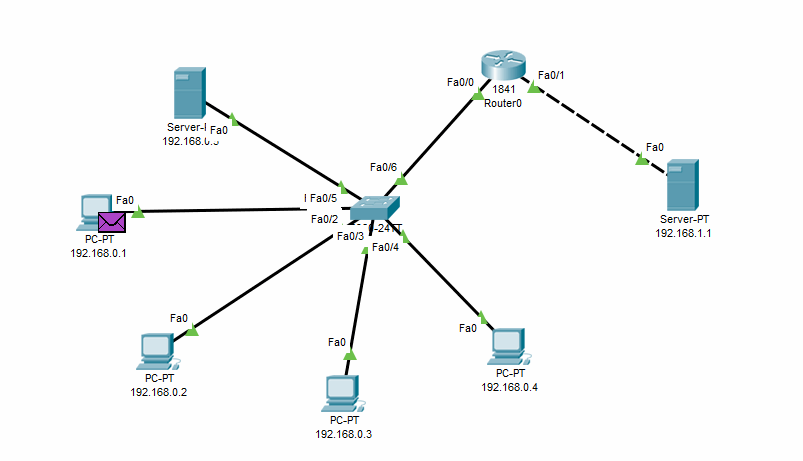
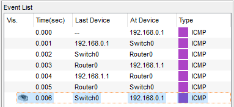
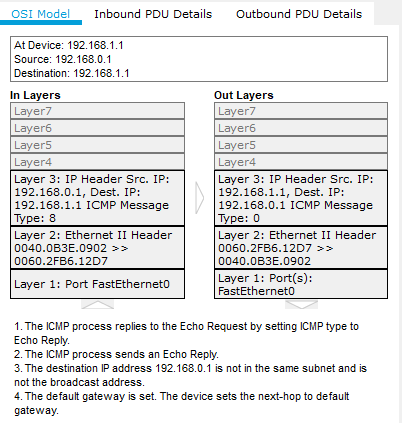

### Networking Fundamentals

---------

I made a local network consisting of 5 PCs and a server. The switch is connected to the router to which the server is connected. Configured routing using the RIP protocol. All devices on the network can exchange ICMP data.
   

   

   

> <b>Routing Information Protocol</b> (RIP) is one of the simplest routing protocols. Used in small computer networks, it allows routers to dynamically update routing information (direction and range in hops) by receiving it from neighboring routers. The limitation of 15 transit sections (hops) does not allow its use in large networks. The advantage of this protocol is that it is easy to configure.
