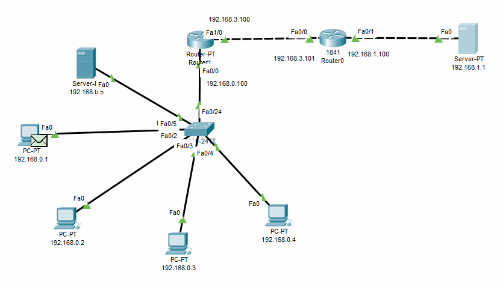
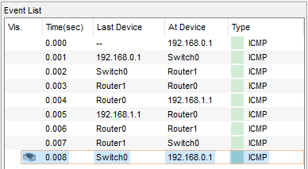
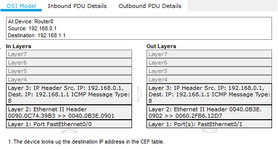
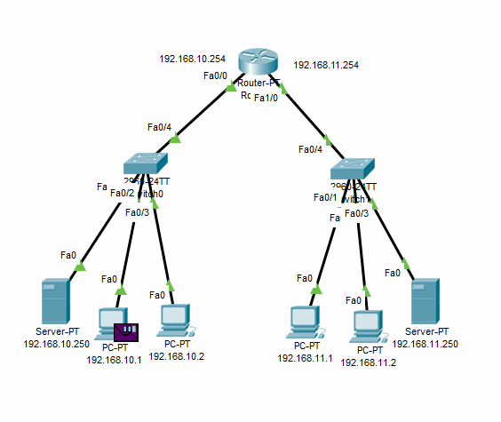
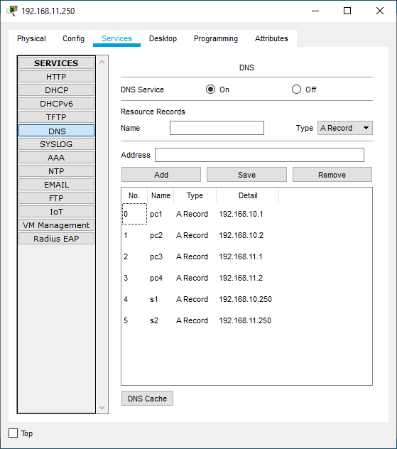
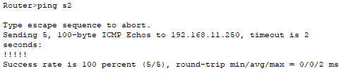
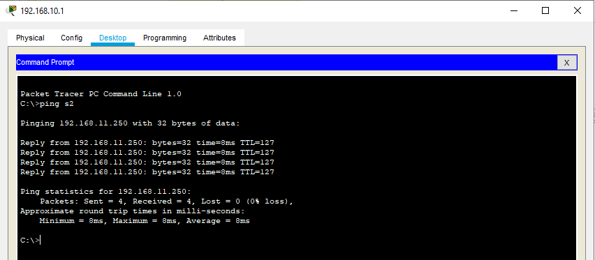

 
### Networking Fundamentals

---------
#### 
Configuring routing through 2 routers

 

> <b>The operation of the router in the OSI model:</b> a signal arrives at the port, and the router recognizes it. The recognized signal (bits) form frames (frames). The checksum in the trailer and the recipient's MAC address are checked. If all checks are successful, the frames form a packet. At the third level, the router examines the packet header. It contains the IP address of the destination (recipient). Based on the IP address and its own routing table, the router chooses the best route for the packets to reach the destination. Having chosen the path, the router encapsulates the packet into frames, and then sends them in bits as signals to the corresponding port (selected in the routing table).

---------
#### 
Organization of 2 subnets. Configuring DNS on servers

 

> DNS is a technology that allows you to find a requested host by its domain. 