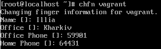
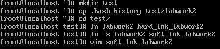

 ### Linux Essentials

---------
#### Part 1
1. I logged in as root on CentOS Linux 8 (“sudo su” - the login is fully performed as root).
   

2. I changed the password for my secondary user.
   

   In the “/etc/passwd” file, each line contains information about all users. Some of these users can be created to run daemons and background services.
   

    “x” is a place for information about passwords.
     
    The password can be found in the “/etc/ shadow” file. 
   

   After the username and ":" is a place for a hashed password.
3. With "w", Linux users get information about the accounts that have been active on the system since the computer was turned on, as well as the actions performed from each account.
   

   
   * USER is the name of the account.
   * TTY is the name of the terminal.
   * FROM is the hostname or IP address from which the user logged into the system under a specific account.
   * LOGIN - the time when this or that account was registered in the system for the first time since turning on the machine.
   * IDLE - the time when the user was active from a specific account.
   * JCPU is the time used by all processes running in the tty terminal.
   * PCPU - time used by the current process (which one can be found in the WHAT column.
   * WHAT - current processes and commands that the user is busy with under a specific account.
  
  The BASH_HISTORY file, as the name suggests, stores the history of data and commands entered using the Bash command line.
    

4. The "chfn" command in Linux allows you to change the full username and associated information. You can view personal information using "finger".
   

5. ”man” and “info” commands display help information on Linux commands.
    <b>passwd -S $user_name –status.</b>
   

   Show account status. The status information contains 7 fields. The first field contains the name of the account. The second field indicates whether the account is locked (L), has no password (NP), or has a work password (P). The third field stores the date when the password was last changed. The next four fields store the minimum age, maximum age, warning period, and password inactivity period. These times are measured in days.
   

   <b>chfn -f "fullName" $ ​​username</b> - change the full name of the user.
   
  6. The command "less / more .bash *" outputs the contents of all files starting with .bash into one display screen.
   

 7.  The .plan file is used for short messages about user busyness.
    

 8. I displayed the contents of the root folder with the command "ls".
   

    The first character in the permission box indicates the file type:
   
   * "-" type: file;
   * "d" type: directory;
   * "l" type: link;

---------
#### Part 2

1. tree - the utility will display a list of all directories and files starting from the current position.

   I listed all directories and files containing the sequence "sql": 
    <b>tree -f -P '\*sql\*' --prune | less</b> :
   

   I have listed subdirectories of the root directory up to and including the second nesting level.
    <b> tree -L 2 | less</b> :
   

2. file - command shows the file type.
   

3. Using <b>cd</b> command without parameter will return you to home directory.
4. ls - displays the contents of a directory.
   

   * "-l" - display a detailed list, which will display the owner, group, creation date, size and other parameters;
   * "-a" - show all files, including hidden ones;
5. I created a subdirectory in my home directory, created a file containing information about directories located in the root directory (using I / O redirection operations), copied the created file to my home directory using relative and absolute addressing. Deleted the previously created file subdirectory and deleted the file copied to the home directory.
    
   

6. I created a "test" subdirectory in my home directory, copied the .bash_history file into that directory, changing its name to "labwork2". Created hard and soft links to the "labwork2" file in the test subdirectory. Modified data with soft link. Removed labwork2.
   
 

   Soft links become invalid after deleting, moving or renaming a file. In a hard link, you can move and rename and even delete a file without breaking the hard link.
7. The "locate" command is used to find files, the search takes place in its own database.
   

8. df - the utility shows a list of all file systems by device names, reports their size, occupied and free space and mount points.
   

9. I count the number of lines containing partitions that are mounted on the system.
    

10. find - command for finding files and directories, for example, to find files by permissions, owners, groups, type, size, and other similar criteria.
    

11. I have listed all the objects in /etc that contain the "ss" character sequence.
    

12. I made a screen by screen print of the contents of the / etc directory.
     <b>ls /etc | less</b>
    

13. Device files are used by the operating system to provide the user and programs with an interface to access devices connected to the computer.
    

    The "b" character stands for Linux block devices, and the "c" character stands for a character.
14. File types in Linux:
    
 

    
    * "l" - softlink;
    * "d" -directory;
    * "-" - regular file;
    Special files:
    * "b" - block;
    * "c" - character;
    * "p" - pipe;
    * "s" - socket.
15. I have listed the first 5 files in the / etc directory that were recently accessed.
    

