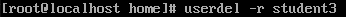
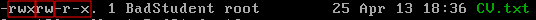

 ### Linux Essentials

---------
1. In the file /etc/passwd there is a list of accounts, in the file through ":" the system name, password (there is the letter “x” here, because the password is hidden in /etc/shadows), UID, GID, full name, home directory and an initial shell.
   

   UIDs "0" to "100" are reserved for pseudo-users.
   

   In the file /etc/group  first there is a group name, then a field for a password (here "x", but passwords for a group are used very rarely), GID, a list of accounts (usernames) included in this group.

2. UID - user identifier.
   
   The <b>/etc/login.defs</b> on my machine (Centos-8) shows
   

   <b>"id"</b> command - displays the user and group ID.
   

   
   Id command keys:
   * "-u" - display only UID codes;
   * "-g" - display only GID codes; 

3.  GID - group identifier.
   The GID can be viewed in the /etc/group.
4. You can determine the user's belonging to a group using a "id" command or in a /etc/group file.
5. <b>useradd $username</b> is the minimum command to create a new user.
   

 

6. Change username only:
<b>usermod -l</b> $new_user_name $old_user_name.
   

7. Directory /etc/skel/ is used to initiate home directory when a user is first created.
   

   Below is a sample /etc/defualt/useradd file which defines the skel directory.
   

8. Using the "-r" option tells userdel to delete the user's home directory and mail folder.

   <b>userdel -r</b> $username
   

9. To temporarily block a user, run the "usermod" command with the "-L" switch. To unlock - with the "-U".
    

10. The string       "U6aMy0wojraho" is the hashed password of the guest user. You need to edit the /etc/shadow file.
      

      

11. The output of the "ls" command with extended details:
    

       * "-l" - display owner, group, creation date, size and other parameters;
       * "-a" - show all files, including hidden ones;
       * "-s" output file size in blocks;
       * "-h" - display folder sizes in an easy-to-read format;
       * "--full-time" - show detailed information, plus all time information in ISO format;
   
12. Access rights are of 3 types:
   * r (4) - read
   * w (2) - write
   * x (1) - execute

   and assigned to 3 types of roles:
   * u - user
   * g -group
   * o - other
   
   

13. For example: 
    

    
    * the owner can read, modify, execute;
    * group members can read and modify; 
    * everyone else can read and execute;
    
14. chown - utility that changes the owner / or group of owners of a file.
    

    chmod - command to change permissions for files and directories.
    

15. <b>umask</b> - contains permissions bits that will NOT be set in new files and directories.
   
      default umask in my CentOS7:
      

      
      By default, umask 0002 is used for a regular user. With this mask, the default permissions for the directory are 775, and for the file 664.

      For superuser (root), the default umask is 022. With this mask, the default permissions for a directory are 755 and for a file 644.

      Rights for example:
    <table>
        <tr>
            <td rowspan="2">
                
<b>UMASK</b>
</td>
            <td colspan="4">
<b>File</b>
</td>
            <td colspan="4">
<b>Directory</b>
</td>
        </tr>
        <tr>
            <td>
<b>rights</b>
</td><td>
<b>owner</b>
</td><td>
<b>group</b>
</td><td>
<b>other</b>
</td>
            <td>
<b>rights</b>
</td><td>
<b>owner</b>
</td><td>
<b>group</b>
</td><td>
<b>other</b>
</td>
        </tr>
        <tr>
            <td>000</td>
            <td>666</td><td>rw-</td><td>rw-</td><td>rw-</td>
            <td>777</td><td>rwx</td><td>rwx</td><td>rwx</td>
        </tr>
        <tr>
            <td>002</td>
            <td>664</td><td>rw-</td><td>rw-</td><td>r--</td>
            <td>775</td><td>rwx</td><td>rwx</td><td>r-x</td>
        </tr>
        <tr>
            <td>022</td>
            <td>644</td><td>rw-</td><td>r--</td><td>r--</td>
            <td>755</td><td>rwx</td><td>r-x</td><td>r-x</td>
        </tr>
        <tr>
            <td>007</td>
            <td>660</td><td>rw-</td><td>rw-</td><td>---</td>
            <td>770</td><td>rwx</td><td>rwx</td><td>---</td>
        </tr>
        <tr>
            <td>077</td>
            <td>600</td><td>rw-</td><td>---</td><td>---</td>
            <td>700</td><td>rwx</td><td>---</td><td>---</td>
        </tr>
        <tr>
            <td>027</td>
            <td>640</td><td>rw-</td><td>r--</td><td>---</td>
            <td>750</td><td>rwx</td><td>r-x</td><td>---</td>
        </tr>
        <tr>
            <td>277</td>
            <td>400</td><td>r--</td><td>---</td><td>---</td>
            <td>500</td><td>r-x</td><td>---</td><td>---</td>
        </tr>
    </table>
     

16. Sticky bit - additional attribute of files or directories, the user can delete only those files that he owns. An example would be the /tmp directory, which can write open to all users, but deleting other people's files is not possible. 
    
    The attribute is set using the chmod utility.
    

   
17. The script must be able to execute (attribute - x)
    
    file * | grep shell | less
    

    

