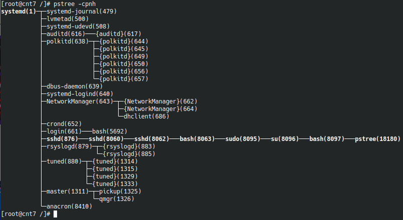
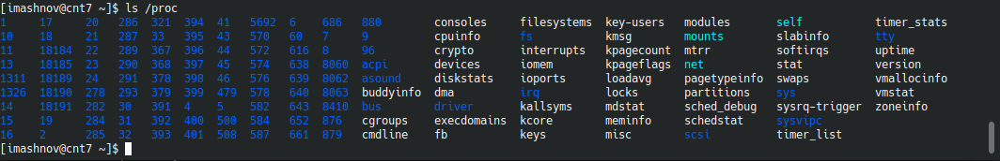
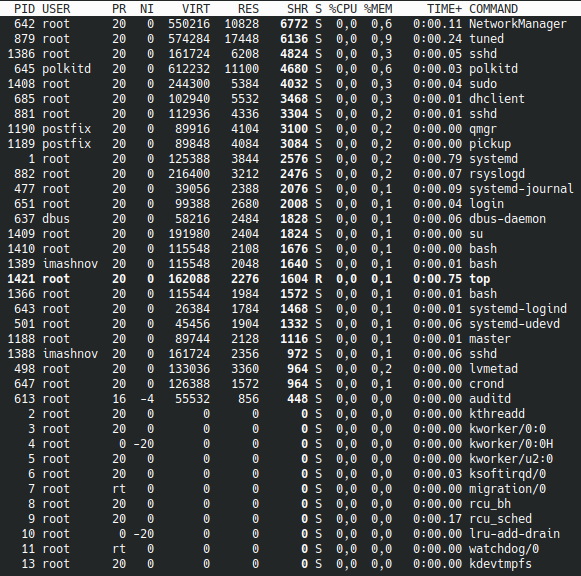

 ### Linux Essentials

---------
### Part 1

1. There are two main types of processes in Linux:

    * Foreground processes (also known as interactive processes) - These are initialized and controlled in a terminal session. In other words, a user must be on the system to run such processes; they do not start automatically as part of system services.
    * Background processes (also known as non-interactive / automatic processes) - not connected to the terminal. They don't wait for user input.
  
   Linux has basically 5 states: 

   * R - process is running or ready to run;
   * D - process in "deep sleep" - waiting for disk I / O;
   * T - the process is stopped;
   * S - process in the waiting state;
   * Z - zombie process;
    

    

1. pstree - displays a hierarchical tree structure of all running processes.
   

2. /proc - a virtual file system, through which any program or user can get data about the state of the computer and the kernel. with the help of which any program or user can get data about the state of the computer and the kernel. All subdirectories, files and information stored in them are generated by the kernel as soon as you request it.
   

3. The <b>lscpu</b> command displays detailed information about the processor. More detailed information about the processor can be displayed with the command: <b>cat /proc/cpuinfo</b>
   

4. <b>ps -Fl</b>
   

  
   * F - flags associated with this process;
   * S - state of the process;
   * UID - the user on whose behalf the process was launched;
   * PID - process identifier;
   * PPID - parent process identifier;
   * C - percentage of CPU time used by the process;
   * PRI - priority of the process;
   * NI - recommended process priority, can be changed;
   * ADDR - address of the process in memory;
   * SZ - size of the process in memory;
   * WCHAN - name of the kernel function that causes the process to be idle;
   * RSS - real size of the process in memory;
   * PSR - processor core on which the process is running;
   * STIME - process start time;
   * TTY - terminal from which the process was launched;
   * TIME - total processor time spent executing the processor;
   * CMD - processor start command;

5. The linux kernel processes are started by the kernel itself, <b>kthread</b> is assigned as the parent process, with PID=2. Thus, the kernel processes must be considered the process itself with PID=2, as well as processes whose PPID (i.e. the parent's pid) = 2.
    

    Also, by default, <b>pstree</b> with no parameters shows processes spawned by the user. Kernel processes will show <b>pstree 2</b>.
    

6. Process statuses:
   

   
   * R - process is running or ready to run;
   * D - process in "deep sleep" - waiting for disk I / O;
   * T - the process is stopped;
   * S - process in the waiting state;
   * Z - zombie process;
  
    Possible process status transitions:
    

7. User specific processes:
   

8. <b>ps</b> - a program that displays a report on running processes.
    

9.  The <b>top</b> command in Linux systems allows you to display running processes in the form of a table, estimate the load on the server and disk system.
Сolumn names:
   * VIRT - virtual memory used by the process;
   * RES - physical memory occupied by this process;
   * SHR - the total amount of memory that this process shares with others;
   * S - current status of the process: R - running; S - sleeping, Z - zombie.
   * NI - process priority;
   * % CPU - percentage of used CPU time;
   * % MEM - the percentage of RAM used by the process;
   *  TIME + - the duration of the process from the start;
   * COMMAND - the name of the command (program) that initiated the process;    
   
11. The <b>-u</b> option matches only the effective user, while <b>-U</b> matches any user (real, effective, saved, or filesystem).
    

12. Interactive commands for <b>top</b>:
    * "l" - remove or return the top line showing the load and uptime;
    * "z" - switch between monochrome and color display;
    * "1" - switch and display information about the processor load in one line, or in several lines for each core;
    * "t" - toggles the view of the line of information about processor usage;
    * "m" - works similarly to the previous one, but for RAM (physical and virtual);
    * "V" - switch to tree view;
    * "i" - switch between all or only active tasks;
    * "H" - switch to showing streams;
    * "L" - search for processes and lines containing a certain value;

13. You can change the sorting using the "<", ">", "x" keys - to highlight the column by which the sorting is going.
    
    Sort by TIME:
    

    Sort by MEM:
    

    Sort by CPU:
    

    Sort by SHR:
    

14. The priority of a process determines how often this process will be executed by the processor, compared to other running processes in the queue for execution. In Linux, the process priority value ranges from -20 to 19 (i.e. 40 possible values ​​are obtained) and is called niceness (NI).
   
      To set the priority when starting a new process:  <b>nice -n $(-20:19) $process</b> 
      
      For existing process: <b>renice -n $(-20:19) $process</b>
   
15. In the top command, "r" is to change the priority of processes using the <b>renice</b> command.
    

16. "kill" - sends a signal to the system to terminate the application.
    

    
    * SIGTERM (15) - this signal requests to stop the process that is running. This signal can be ignored. The process is given time to shut down well and save its progress and free up resources.

    * SIGKILL (9) - a signal causes the process to terminate its work immediately. The program cannot ignore this signal. Unsaved progress will be lost.

    

17. nohup - utility that allows you to run a hang-protected command with an output to a non-tty (ignores the loss of SIGHUP communications).

    To run the task in the background, you need to add the "&" sign at the end of the command.

    jobs - display a list of current background jobs.

    bg - will continue executing the program in the background.

    fg - take the program out of the background or from pause and background at the same time.
    

---------
### Part 2

1. Find out the uptime of the remote server, find out how much free disk space, 
find out how much memory is being used and the average load:
    

2. To increase the level of security: you can change the connection port:
   
    

    

   the file <b>/etc/ssh/sshd_config</b> stores ssh settings

    Create RSA key pairs:
    

    

    

    Disable password authentication:
    

    Prohibit the user from entering the root:
    

    

3. Choosing an algorithm:
    
    <b>rsa</b> - an old algorithm based on the difficulty of factoring large numbers. A key size of at least 2048 bits is recommended for RSA; 4096 bits is better. 
    

    <b>ecdsa</b> - a new Digital Signature Algorithm standarized by the US government, using elliptic curves. This is probably a good algorithm for current applications. Only three key sizes are supported: 256, 384, and 521 bits.
    

    <b>ed25519</b> - this is a new algorithm added in OpenSSH. Support for it in clients is not yet universal. Thus its use in general purpose applications may not yet be advisable.
    

    

4. I have configured port forwarding for SSH connection from kubuntu host machine to CentOS7 guest VM:
   

   

   
5. ???
   
