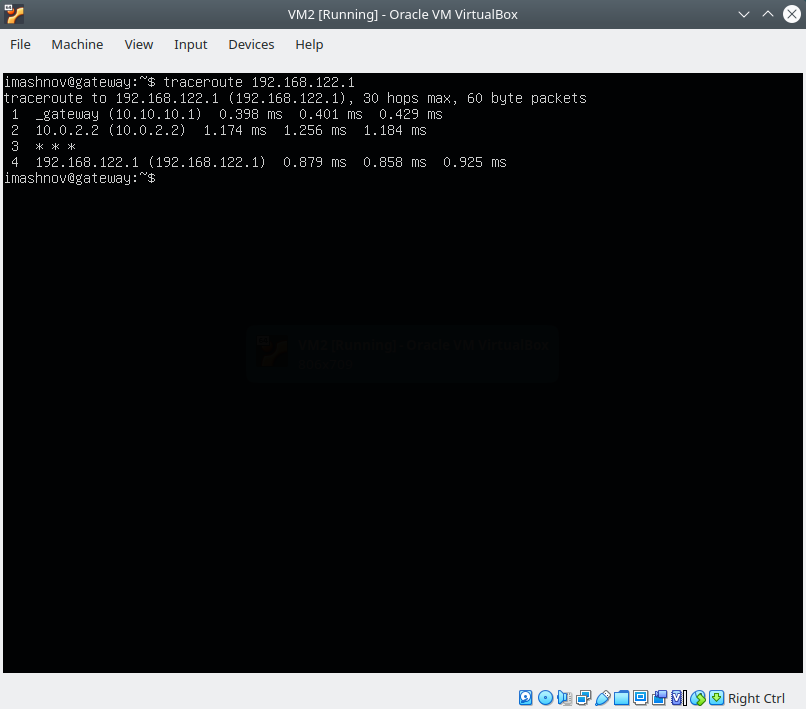
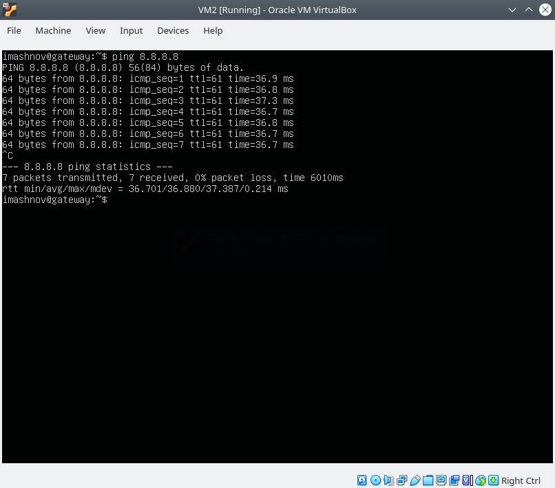

 ### Networking with Linux

1. I created a group of virtual machines connected according to the scheme (see below).
      

2. VM2 has one interface (internal), VM1 has 2 interfaces (NAT and internal). VM2 has an access to the Internet (iptables, forward, masquerade).
      

3. I checked the routing from VM2 to Host.
      

4. I checked the access to the Internet.
       

5. Determining which resource has an IP address 8.8.8.8.
   

6. Determining which IP address belongs to resource epam.com.
   

7. Determining the default gateway for my HOST.
   

    

8. Tracing the route to google.com
   

