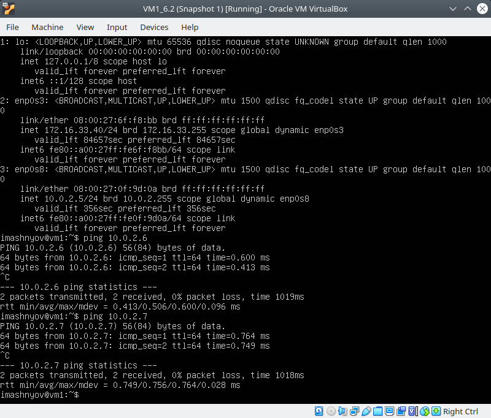
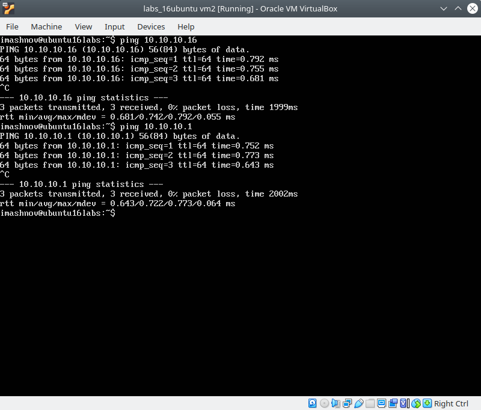

  ### Configuring DHCP, DNS servers

1. I created a new network with three VMs. VM1 has NAT and internal interfaces, VM2 and VM3 - internal only interfaces.
2. At first I configured a DHCP server in VirtualBox:
    

    

    

    

    

    

    

    

3. In the second way, I set up a DHCP server using dnsmasq on VM and two VM use like clients:
   

   

   

   

   

   

   

