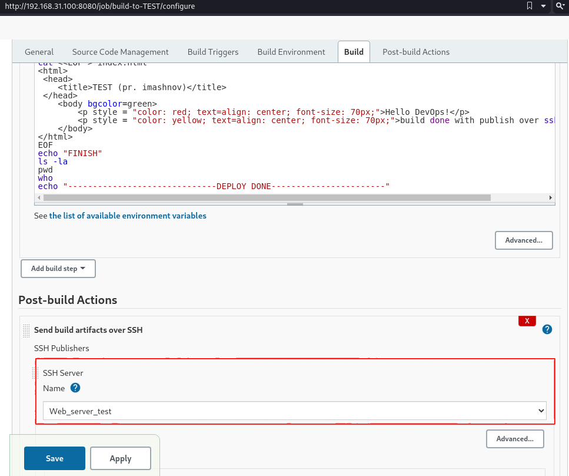
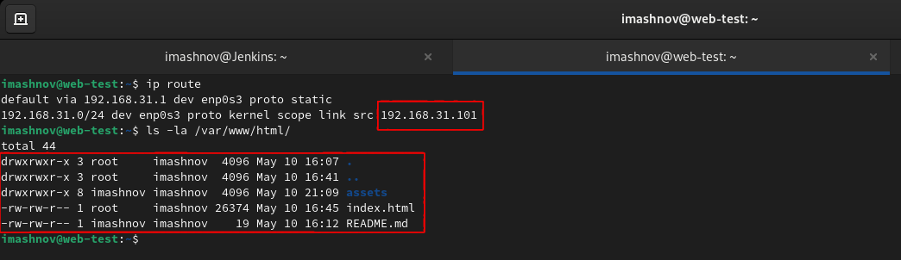
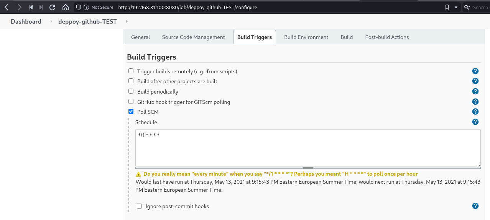
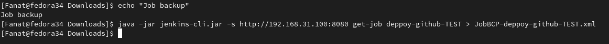
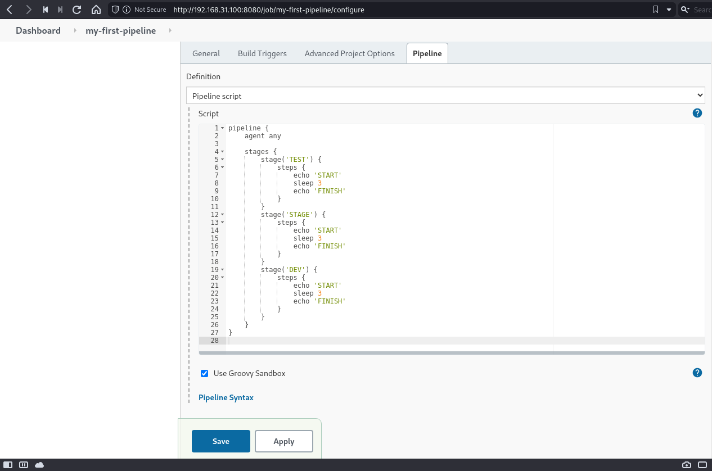
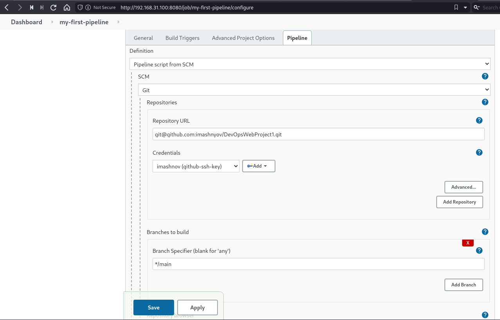

### CI/CD (Jenkins)

I launched Jenkins on VM1 (with a static ip 192.168.31.100) and developed a simple job.

Then I limited the recording of a job on the server to 5 jobs (to save disk space).

I have installed additional Jenkins plugins such as "Locale" and "Green Balls".

I deployed a simple html page to the Apache web server on VM2 (with a static ip 192.168.31.101) using ssh.

Then I added credentials for my web server and deployed the modified html page.

I connected the main branch of the repository with my web project to the integration job.

And I made a deployment to the web server of my repository.

To deploy the directory from GitHub, you need to use "*/**/**" where we choose which files we can integrate.

Because there is no way to set up a web-hook on a virtual machine, I used time checking (SCM).

I used VM3 (with static ip 192.168.31.99) as a slave for Jenkins.

Jenkins Slave, a slave is a Java executable that runs on a remote machine. The characteristics of the slave are: It hears requests from the Jenkins Master instance. Slaves can run on a variety of operating systems.

I installed Jenkins CLI on VM1 with Jenkins and tried different authentication options.

Then I installed Jenkins CLI on my laptop and tried remote commands for Jenkins.

I made a backup of my job.

Then I created a new job from the backup.

I created my first pipeline and Jenkins file on a remote repository.

