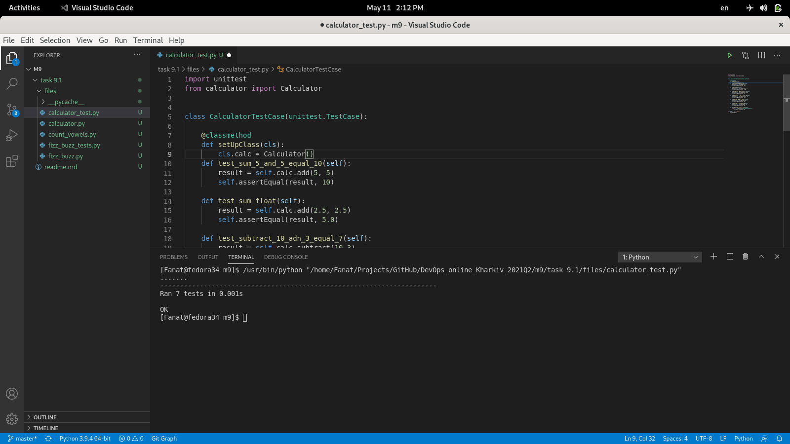

### Introduction to Python

#### FizBuz
I studied what the FizBaz script is made of and checked the unit tests for it.
 

#### Сalculator
I studied what the calculator script is made of, created and launched unit tests for it.
 

