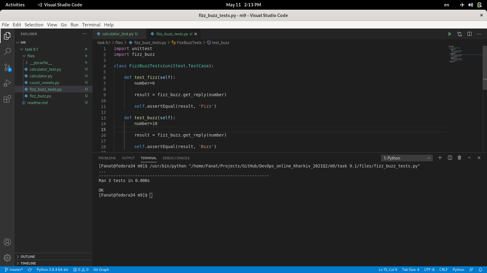

### Introduction to Python

#### FizzBuzz
I studied what the FizzBuzz script is made of and checked the unit tests for it.
 

  
<a href="files/fizz_buzz.py">FizzBuzz Script</a>
 
<a href="files/fizz_buzz_tests.py">FizBuz test</a>

#### Сalculator
I studied what the calculator script is made of, created and launched unit tests for it.
 
<a href="files/calculator.py">Calculator Script</a>
 
<a href="files/calculator_test.py">Calculator test</a>
